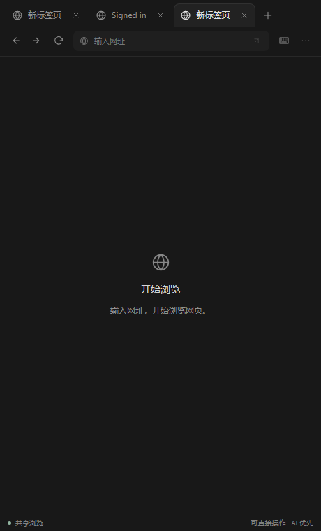

# DSH Background Browser · 后台浏览器插件

`dsh-plugin-background-browser` · [GitHub 仓库](https://github.com/YuZtArt/dsh-plugin-background-browser)

让 DeepSeek Harness 助手直接操作隐藏的浏览器，无需手动打开 Chrome。项目采用 DSH 的 **Cordis 插件机制**，不是 DeepSeek API 客户端。

当前浏览器插件版本：**0.5.0** · 目标宿主：**DSH 0.1.5-rc.2**。

## 功能与当前状态

- **后台网页操作**：导航、读取页面、点击、输入、标签页管理、JavaScript 求值和截图，复用 Playwright MCP 工具。
- **会话隔离**：每个活动 agent 独立浏览器和 Cookie，跨轮次保留状态，卸载时清理。
- **侧栏交互（实验性）**：在 DSH 原生右侧栏注册「浏览器」卡片，约每 750ms 刷新当前网页截图；支持直接点击、输入、滚动和标签页管理；提供地址栏、后退、前进与刷新。
- **桌面运行兼容处理**：MCP 子进程显式启用 Electron-as-node，并使用宿主 agent 作用域避免工具撞名。

**验证状态：** 侧栏交互与导航已通过真实浏览器组件集成测试；完整 Desktop 2.0.10 运行流程仍待实机验证。

## 界面截图

以下为实际客户端组件在本地测试环境中的截图，不是完整桌面客户端截图。




## 环境要求

| 项目 | 要求 |
| --- | --- |
| DSH | 0.1.5-rc.2，依赖锁定到该版本 |
| Node.js | 22.19+（22.x）或 24+ |
| 浏览器 | Playwright 配套 Chromium Headless Shell |
| 已测试平台 | Windows；其他系统尚未验证 |

项目 npm scripts 优先使用本地 Node 22.23.2；直接运行 `dsh` 时仍需使用兼容的宿主运行环境。

## 安装

从 [GitHub Release 下载预构建安装包](https://github.com/YuZtArt/dsh-plugin-background-browser/releases/download/v0.5.0/dsh-plugin-background-browser-0.5.0.tgz)，或按下方步骤自行构建。**安装到桌面客户端实际使用的 profile**，并使用相同的 DSH_HOME 和用户账户。不要另外创建一个 profile 后期待它出现在现有桌面端。

在能调用该桌面环境 DSH CLI 的 PowerShell 中：

```powershell
$desktopProfile = '替换为当前档案名称'
$pluginPackage = (Resolve-Path ./dsh-plugin-background-browser-0.5.0.tgz).Path
dsh plugin --profile $desktopProfile add $pluginPackage
# 仅首次安装浏览器时需要；已经安装成功则跳过。
dsh plugin --profile $desktopProfile exec dsh-browser-install
```

安装或升级后完全退出并重开桌面客户端。旧版可直接覆盖安装，无需重复下载浏览器。若终端找不到 `dsh`，请使用桌面端配套 CLI，不要为此安装另一套不匹配的全局 DSH。

## 使用

向助手发送：

> 使用后台浏览器打开 https://example.com，读取页面标题并截图。

查看画面时，展开原生右侧栏，点击 `＋`，在「开始」页选择「浏览器」。可直接点击网页输入框。可直接键盘输入；中文或密码可点击地址栏旁的键盘图标，展开输入面板后发送到网页当前焦点。

无需选择控制权，AI 与用户共享浏览器。排队时 AI 操作优先；已开始的单次操作执行完再切换。AI 改变页面后，基于旧画面的输入会提示重试。登录完成后在对话中告诉助手继续，不要把密码发到聊天里。

若只有「工作区文件」卡片，说明浏览器前端入口尚未出现在当前界面；后台工具成功并不代表前端已加载。先确认安装版本、当前 profile 和完整重启，再检查客户端加载日志。详细说明见 [浏览器插件文档](packages/browser/README.md)。

「更多选项」中可暂停预览、切换网页原始大小或全屏查看。地址栏可直接导航，支持 HTTP/HTTPS 网址；暂不提供搜索和下载管理。

## 从源码构建

```powershell
npm ci
npm run check
npm run browser:install
npm run test:browser
npm run pack:browser
```

根目录生成可安装的 `.tgz`。本仓库不提交 `node_modules`、`dist`、浏览器缓存或安装包。源码目录本身不是已编译安装包。

| 命令 | 用途 |
| --- | --- |
| `npm run check` | 类型检查、构建、Cordis 与包导出回归测试 |
| `npm run test:browser` | 真实 rc.2 服务、MCP、隐藏浏览器及预览组件集成测试；无需 API key |
| `npm run pack:browser` | 构建并打包浏览器插件 |
| `npm run pack:starter` | 构建并打包插件开发示例 |
| `npm run dev` | 仅持续编译 starter，不启动 DSH |

## 项目结构

```text
packages/browser/           后台浏览器插件及侧栏客户端
packages/starter/           Cordis 插件开发示例
tests/                      生命周期、包导出及浏览器集成测试
docs/plugin-development.md  开发约定和 API 参考
CHANGELOG.md                版本变更
```

## 验证范围与限制

已验证首次提示词包含工具、多会话与子 agent 同名工具注册、页面操作、Cookie 隔离、截图、预览组件和卸载清理。客户端组件测试使用模拟槽位注册器；完整桌面应用、真实模型自主执行及第三方网站登录/验证码兼容性不在已验证范围内。已在本地登录页验证人工点击、中文密码输入、键盘选择、滚动、提交及与 AI 共享登录 Cookie。文件上传、拖拽和系统通行密钥暂不支持。

浏览器登录状态不会在宿主重启或会话恢复后恢复。插件不绕过 DSH 工具授权流程，也不提供 API key。

## 开发资料

- [插件开发指南](docs/plugin-development.md)
- [版本变更](CHANGELOG.md)
- [DeepSeek Harness 官方仓库](https://github.com/deepseek-ai/deepseek-harness)
- [DeepSeek Harness 官方文档](https://deepseek-harness.github.io/deepseek-harness/)
- [Playwright MCP](https://github.com/microsoft/playwright-mcp)

提交问题时请附 DSH 和桌面端版本、插件版本、操作步骤及去除凭据的报错。文档和问题交流以中文为主。

## 许可证

项目采用 [MIT](LICENSE) 许可证。Playwright MCP、Playwright 和 DSH 等依赖保留各自许可证。源码仓库已公开，npm 包仍标记 `private` 以避免误发布；安装请使用 Release 中的预构建包。
