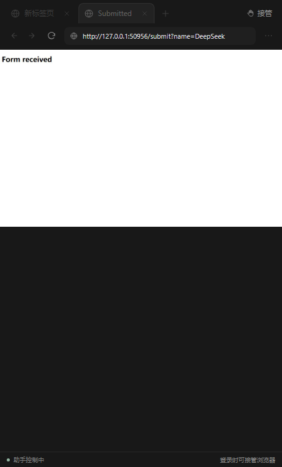
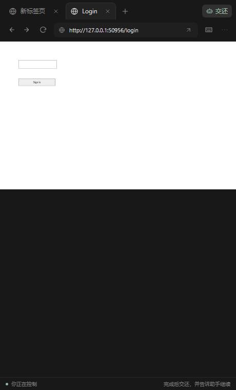

# DSH 后台浏览器

给 DeepSeek Harness 增加默认无窗口运行的 Chromium 浏览器。模型通过浏览器工具打开网页、读取页面、点击、输入、管理标签页和截图，用户不需要先打开浏览器。

## 安装

插件 **0.4.0** 适配 **DSH 0.1.5-rc.2**，不需要升级到 alpha。需要 Node 22.19+ 或 24+。所有 DSH 依赖均固定为 rc.2，不混用 alpha 包；此前插件 0.1.0 是 alpha 版本用包，请改装 0.2.1。

推荐从 [GitHub Release](https://github.com/YuZtArt/dsh-plugin-background-browser/releases/tag/v0.4.0) 下载预构建包。

在本项目中：

```powershell
npm ci
npm run browser:install
npm run check
npm run test:browser
npm run pack:browser
```

以下仅用于独立开发测试。桌面端安装请跳到下一节，使用实际活动 profile。

在已使用兼容 Node、安装了匹配版本 DSH 的环境中，为插件创建独立 Web profile：

```powershell
# 仅新 profile 第一次执行；dump-config 不启动应用。
dsh --profile browser-dev --from-default-profile web --dump-config
dsh plugin --profile browser-dev add C:/path/to/dsh-plugin-background-browser-0.4.0.tgz
# 在运行 DSH 的同一用户账户下安装浏览器，仅首次需要。
dsh plugin --profile browser-dev exec dsh-browser-install
dsh --profile browser-dev --dump-config
dsh --profile browser-dev --no-open
```

`--no-open` 避免 DSH 自动打开它自己的 Web 界面；插件操作网页的浏览器始终隐藏，两者独立。通过终端打印的网址访问 DSH 界面，然后创建会话。插件在活动会话下一次组装模型提示词时初始化浏览器工具，因此也能服务加载前已存在的会话。

可给模型这样的任务：“使用后台浏览器打开目标网址，读取页面，再根据我的要求操作。”无需单独运行 MCP 服务或手动启动 Chrome。

## 桌面客户端右侧栏

历史架构参考来自 [deepseek-harness-desktop](https://github.com/dsh-tauri-desk/deepseek-harness-desktop)。核对的桌面源码版本为 0.14.3，commit `b2e859442fbf1acabcccbe6f48d9714231102fb5`：其界面嵌入 DSH Web。插件使用 rc.2 原生右侧栏扩展接口。实际反馈环境为 Electron Desktop 2.0.10，与该参考仓库不同；侧栏入口在 0.2.1 中未显示，0.2.2 修复后仍待该环境复测。

安装到**桌面客户端当前使用的 profile**，不要装进另一个开发 profile。可从客户端设置确认当前档案；不同版本可能使用不同名称，不要直接假设是 `web` 或 `tauri`。在可运行匹配版本 DSH CLI 的终端中执行：

```powershell
$desktopProfile = '替换为桌面客户端当前档案名'
dsh plugin --profile $desktopProfile add C:/path/to/dsh-plugin-background-browser-0.4.0.tgz
dsh plugin --profile $desktopProfile exec dsh-browser-install
```

命令须使用与桌面端相同的 DSH_HOME、用户账户和兼容 Node。安装后重启桌面端 DSH 服务，在会话原生右侧栏的新增标签页/引导入口选择「浏览器」，让助手打开网页即可观看。若启用了替代原生右侧栏的扩展，需确认它仍保留原生标签页入口；尚未在用户实际安装的桌面客户端验证该组合。

面板显示当前网址、标签页和约每 750ms 更新的截图，提供暂停/继续和刷新。0.3.0 支持接管后通过截图坐标操作同一个浏览器，包括点击、键盘输入、粘贴、滚动和标签页切换。收起或关闭面板不终止后台任务，切换会话后跟随对应浏览器。登录时点击「接管浏览器」，完成后点击「交还助手」并通知助手继续；关闭面板不会自动交还控制权。中文及密码可通过工具栏键盘图标展开的输入框输入到网页当前焦点，输入内容不进入聊天工具参数。第三方验证码兼容性仍取决于网站；不支持文件上传、拖拽或系统通行密钥。

## 配置

安装包只插入 `dshplugins-background-browser` 一行，无需 rc.2 不存在的 browser-use 注册表。不要同时挂载本插件的多个实例或另一个名为 `playwright-mcp` 的 MCP 服务，以免工具命名冲突。

默认使用 Playwright 配套 **Chromium Headless Shell**。可在 profile 的 `cordis.patch.yml` 覆盖插件配置：

```yaml
- id: dshplugins-background-browser
  config:
    toolCallTimeoutMs: 60000
    # 可选，必须是完整绝对路径：
    # executablePath: 'C:/path/to/chromium.exe'
```

配置覆盖替换整行 config。没有 `executablePath` 时使用配套引擎。插件不提供 headed/attach 开关，始终新建隐藏且隔离的浏览器，不接管用户的日常浏览器。

## 模型使用方式

工具保留上游名称，例如 `mcp__playwright-mcp__browser_navigate`、`browser_snapshot`、`browser_click`、`browser_type`、`browser_tabs`、`browser_take_screenshot`；后五者也带同一完整前缀。

导航/点击的自动快照可能只返回文件链接。调用 `browser_snapshot` 且不传 `filename` 才会内联返回页面元素。固定版本的点击/输入工具使用 `target` 参数，传入快照中的 `e1` 等元素引用；以运行时工具 schema 为准。插件会把这些浏览器使用指引加入拥有浏览器工具的会话。

## 生命周期与边界

- 浏览器工具在 Session 首次组装模型提示词时连接，组装会等待工具就绪；同时启动隐藏的浏览器引擎。
- 一个活动 Session 的多个轮次共享页面和 Cookie；不同 Session 隔离。
- 关闭 Session 或卸载插件会关闭自有资源；重启、恢复或 fork 不恢复浏览器登录状态。
- 登录、验证码等需要人工操作的网页可能阻塞任务；可通过侧栏人工接管，第三方网站登录兼容性仍需实际验证。
- 截图可保存到文件。图片进入模型还依赖 DSH 附件存储和模型的图片输入能力。
- 浏览器权限遵循宿主工具管线；插件不替用户绕过授权。

## 实现与验证

基于 rc.2 已发布的 `dsh-mcp-client` 和 `dsh-scope` 实现 Session 归属、串行调用及卸载清理，复用 `@playwright/mcp@0.0.80` 浏览器工具。rc.2 的 `agent/created` 是同步通知，所以在异步 `system-prompt/assemble` 中等待 MCP 就绪并重新组装一次，确保首次模型请求就能看到工具。通过公开 Playwright API 创建隔离的 Headless Shell，再让 MCP 通过本机 CDP 连接到同一个浏览器；面板截图来自该浏览器，未修改上游源码或调用 Playwright 内部注册表。

已在 Windows 上使用全套 **0.1.5-rc.2** 服务，通过真实 DSH Agent/Session/Tools → MCP → Chromium 链路验证首次提示词含浏览器工具、导航、页面快照、输入与提交、HeadlessChrome 标识、PNG 截图、Cookie 保留、会话隔离和卸载。测试使用本地网页，不需要 API key。安装命令已对照 rc.2 CLI 发布包核对。尚未验证完整 DSH Web 应用、真实模型自主调用及用户现有 profile；已额外验证预览 HTTP 接口和真实浏览器中挂载的客户端组件，包括画面、暂停/继续、会话切换和卸载；组件测试使用模拟槽位注册器，不等同于完整桌面客户端验证。

## 0.2.1 桌面兼容修复

针对反馈环境 DSH Desktop 2.0.10 / DSH 0.1.5-rc.2 / Windows / Electron-as-node 24.18.1：MCP 子进程显式传入 `ELECTRON_RUN_AS_NODE=1`，避免 `process.execPath` 指向桌面 exe 时启动 GUI；浏览器安装命令也传入该标志。

MCP 直接挂载在宿主提供的 `agent.ctx` 子生命周期中，不再通过插件私有的 `dsh-scope` 副本创建作用域。每个 agent 独立连接及浏览器，工具不注册到全局；MCP client 改为 rc.2 peer dependency，与宿主共享依赖实例。保留首轮提示词等待及 `TOOLS_SDK - 1` 修复。

新增回归测试模拟插件持有独立 scope 模块副本，同时运行两个会话和一个子 agent，检查首轮工具、全局无工具泄漏、Cookie 隔离及独立清理；拦截实际子进程启动参数确认 Electron 标志。测试在本地 Node 执行，尚未在 Desktop 2.0.10 的 Electron 运行时复测。此前桌面侧栏源码核对的是 Tauri 0.14.3，不代表已验证 Desktop 2.0.10 的界面。

## 0.2.2 侧栏入口发现修复

增加 `exports["./package.json"]`。核对 npm 发布的 `dsh-client-modules@0.1.5-rc.2`：当宿主没有 `loader.internal.resolveSync` 时，客户端扫描器使用 `require.resolve("插件名/package.json")` 查找 manifest；此前该路径被 exports 阻止，扫描器会静默跳过前端，而后台工具仍可正常工作。新增回归测试覆盖这条解析路径。此修复尚需在用户 Desktop 2.0.10 中确认。

升级后完全退出并重开桌面客户端（加载器会缓存扫描结果），点击右侧栏 `＋`，在「开始」页应看到「浏览器」卡片。若仍只有「工作区文件」，需要检查前端加载日志及实际安装版本，不必重装 Chromium。

## 0.3.0 人工接管

新增「接管浏览器／交还助手」。人工操作与 agent 工具共用串行队列，接管会等待已开始的工具调用结束；接管期间后续浏览器工具调用会返回等待用户的提示，不暂停整个 agent。输入使用已显示页面的稳定 ID 和相对坐标，避免标签页关闭后按旧索引操作另一个页面。

测试使用本地登录表单，覆盖人工点击、中文密码输入、全选、滚动、提交、交还后模型工具读取登录 Cookie、未接管时拒绝输入。尚未验证所有外部站点或 Desktop 2.0.10 的完整运行流程。

## 界面截图

实际客户端组件在本地测试环境的截图，非完整桌面端截图。





## 许可证

[MIT](LICENSE)。上游依赖保留各自许可证。

## 0.4.0 浏览器界面

采用紧凑深色标签栏、地址栏与图标工具栏。接管后支持网址导航、后退、前进、刷新、新建和关闭标签页。键盘图标按需展开中文/密码输入；更多菜单提供暂停预览、原始大小和全屏。空白页显示开始浏览提示。
